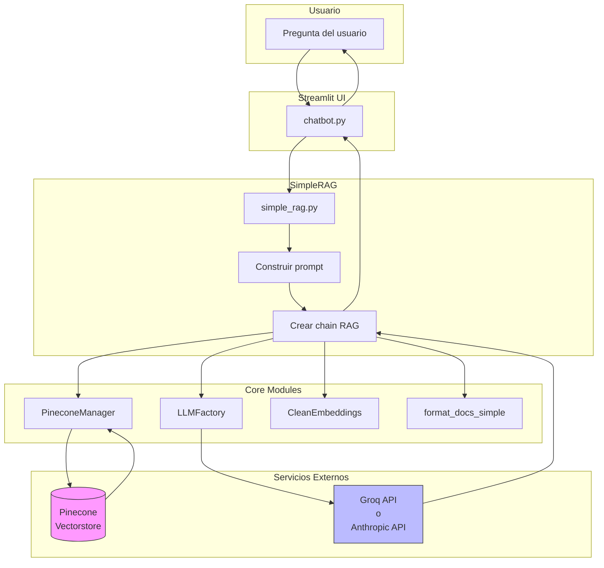
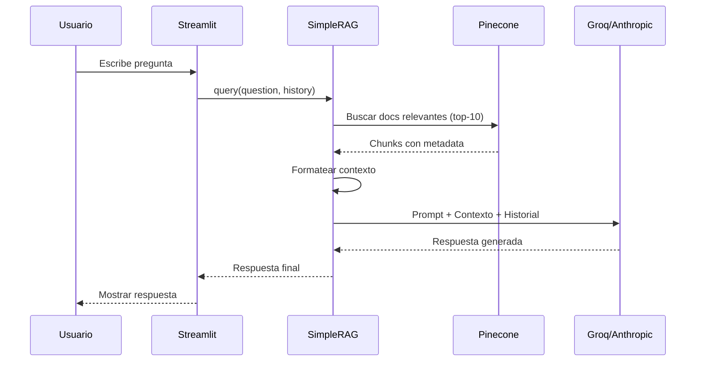

# TP2 - Sistema RAG para análisis de currículums

Sistema de preguntas y respuestas sobre CVs usando Retrieval Augmented Generation (RAG) con soporte para múltiples proveedores de LLM (Groq y Anthropic).

**Autor:** Martin Brocca  
**Curso:** CEIA - NLP2  
**Universidad:** Universidad de Buenos Aires

## Descripción

Aplicación de Streamlit que permite analizar currículums en formato PDF mediante preguntas en lenguaje natural. Utiliza embeddings para búsqueda semántica en Pinecone y LLMs para generar respuestas contextualizadas.

## Videos de demostración de la aplicación
Se generaron dos videos para evitar los límites de archivos grandes de GitHub
  - [Demo1-Llama](./Video/Demo_TP2_Llama.mov)
  - [Demo2-Claude](./Video/Demo_TP2_Claude.mov)

## Estructura del proyecto

```
TP2/
├── core/                           # Módulos compartidos (reutilizables en TP3)
│   ├── __init__.py                # Exports del paquete
│   ├── embeddings.py              # CleanEmbeddings wrapper (BGE-large)
│   ├── vectorstore.py             # PineconeManager (gestión del índice)
│   ├── llm.py                     # LLMFactory (Groq y Anthropic)
│   └── utils.py                   # Funciones helper (extracción, formateo)
│
├── simple_rag.py                  # Clase SimpleRAG (lógica principal)
├── chatbot.py                     # Interfaz Streamlit
├── requirements.txt               # Dependencias del proyecto
├── .env.example                   # Plantilla de variables de entorno
├── README.md                      # Este archivo
├── resumes/                       # Carpeta para PDFs de CVs
│   ├── Candidato1.pdf
│   └── Candidato2.pdf
└── Video
    ├── Demo_TP2_Claude.mov
    └── Demo_TP2_Llama.mov

```

## Arquitectura del Sistema




## Flujo de ejecución



## Requisitos

### Software

- Python 3.11 o superior
- pip (gestor de paquetes)

### API Keys Requeridas

1. **Pinecone** (obligatorio)
   - Registro: https://app.pinecone.io/
   - Plan gratuito disponible

2. **Groq** (opcional - si usas modelos de Groq)
   - Registro: https://console.groq.com/
   - Límites generosos gratuitos

3. **Anthropic** (opcional - si usas modelos Claude)
   - Registro: https://console.anthropic.com/
   - $5 USD de crédito inicial gratuito

**Nota:** Se requiere al menos una de las API keys de LLM (Groq o Anthropic).

## Instalación

### 1. Clonar o descargar el proyecto

```bash
cd ~/CEIA/CEIA-NLP2/Trabajos/TP2
```

### 2. Crear entorno virtual

```bash
python -m venv .venv
source .venv/bin/activate  # En Linux/Mac
# .venv\Scripts\activate   # En Windows
```

### 3. Instalar dependencias

```bash
pip install -r requirements.txt
```

### 4. Configurar variables de entorno

Crear archivo `.env` en la raíz del proyecto:

```bash
# Obligatorio
PINECONE_API_KEY=tu_api_key_de_pinecone

# Opcional - al menos una de las dos siguientes
GROQ_API_KEY=tu_api_key_de_groq
ANTHROPIC_API_KEY=tu_api_key_de_anthropic
```

**Ubicaciones válidas para .env:**
- `Trabajos/TP2/.env` (local al proyecto)
- `CEIA-NLP2/.env` (compartido entre TPs)
- Directorio desde donde ejecutas Streamlit

### 5. Preparar carpeta de resumes

```bash
mkdir -p resumes
# Copiar archivos PDF de CVs en esta carpeta
```

**Formatos de nombre soportados:**
- `Martin Brocca - Resume.pdf`
- `Jane Doe CV 2024.pdf`
- `John_Smith.pdf`

El sistema extrae automáticamente:
- Nombre del candidato (del nombre del archivo)
- Ubicación (del header del CV)

## Uso

### Ejecutar la aplicación

```bash
cd Trabajos/TP2
streamlit run chatbot.py
```

La aplicación se abrirá en `http://localhost:8501`

### Flujo de uso

1. **Indexar CVs**
   - Click en "Re-indexar CVs" en la barra lateral
   - Esperar a que termine la indexación (10-30 segundos)
   - Verificar que aparezcan los candidatos cargados

2. **Configurar modelo**
   - Seleccionar modelo de Groq o Anthropic
   - Ajustar temperatura (0.0 = preciso, 1.0 = creativo)
   - Opcionalmente agregar instrucciones personalizadas

3. **Hacer preguntas**
   - Escribir pregunta en el chat
   - El sistema recuerda los últimos 10 mensajes de contexto

### Ejemplos de preguntas

**Comparaciones:**
```
- ¿Qué candidato tiene más experiencia laboral?
- Compara las habilidades técnicas de Martin y Ariadna
```

**Búsquedas específicas:**
```
- ¿Algún candidato vive en Estados Unidos?
- ¿Quién tiene experiencia en Python?
- ¿Algún candidato maneja Azure?
```

**Evaluaciones:**
```
- ¿Algún candidato podría ocupar un puesto de arquitecto de datos?
- Son los candidatos junior, semi-senior o senior?
```

**Con instrucciones personalizadas:**
```
Instrucciones: "Responde en formato de tabla comparativa"
Pregunta: "Compara experiencia y ubicación de todos los candidatos"
```

## Configuración

### Modelos disponibles

**Groq:**
- Llama 3.3 70B (recomendado)
- Llama 3.1 70B
- Mixtral 8x7B
- Llama 3.1 8B (más rápido)

**Anthropic:**
- Claude Sonnet 4.5 (más inteligente)
- Claude 3.5 Sonnet (balance calidad/velocidad)
- Claude 3.5 Haiku (más rápido y económico)

### Parámetros ajustables

- **Temperature:** 0.0 (determinístico) a 1.0 (creativo)
- **Instrucciones personalizadas:** Texto adicional para modificar el comportamiento
  - Ejemplo: "Responde siempre en bullet points"
  - Ejemplo: "Presenta comparaciones en formato de tabla markdown"

### Características

- Memoria conversacional (últimos 10 mensajes)
- Extracción automática de ubicación de CVs
- Inferencias razonables (ej: "TX, US" → "vive en Estados Unidos")
- Flush automático del índice en re-indexación
- Soporte multi-provider (Groq y Anthropic)

## Tecnologías Utilizadas

### Framework y UI
- **Streamlit:** Interfaz web interactiva
- **LangChain:** Orquestación de componentes RAG

### Embeddings
- **Modelo:** BAAI/bge-large-en-v1.5
- **Dimensiones:** 1024
- **Proveedor:** HuggingFace

### Vector Database
- **Pinecone:** Almacenamiento y búsqueda vectorial
- **Métrica:** Cosine similarity
- **Top-k:** 10 documentos recuperados

### LLMs
- **Groq:** Llama 3.3 70B, Mixtral 8x7B
- **Anthropic:** Claude Sonnet 4.5, Claude 3.5 Sonnet/Haiku

### Procesamiento de texto
- **Chunking:** RecursiveCharacterTextSplitter
  - Tamaño: 1600 caracteres
  - Overlap: 400 caracteres (25%)
- **Extracción PDF:** PyPDF2

## Parámetros Técnicos

### Chunking
```python
chunk_size = 1600    # Suficiente para secciones completas de CV
chunk_overlap = 400  # 25% de overlap para evitar pérdida de contexto
```

**Justificación:** Los CVs tienen secciones bien definidas (Experiencia, Educación, Skills). Un chunk de 1600 caracteres captura típicamente una sección completa o 2-3 posiciones laborales.

### Retrieval
```python
k = 10  # Número de chunks recuperados
```

**Justificación:** Con 2 CVs de ~3 páginas cada uno, se generan ~15 chunks. Recuperar k=10 asegura cobertura de ambos candidatos manteniendo contexto manejable para el LLM.

### Memoria conversacional
```python
history_length = 10  # Últimos 10 mensajes
```

**Justificación:** Balance entre contexto suficiente (5 turnos de conversación) y límite de tokens del LLM.

## Troubleshooting

### Error: "No se encontraron PDFs"
- Verificar que los PDFs estén en `Trabajos/TP2/resumes/`
- Verificar extensión `.pdf` (case-sensitive en Linux/Mac)

### Error: "Se requiere GROQ_API_KEY" o "Se requiere ANTHROPIC_API_KEY"
- Verificar que el `.env` tenga la API key correcta
- Reiniciar Streamlit completamente (Ctrl+C y volver a ejecutar)
- Verificar ubicación del `.env` (debe estar en raíz del proyecto o CEIA-NLP2/)

### Error: "El índice no existe"
- Hacer click en "Re-indexar CVs"
- Esperar a que complete los 4 pasos
- Verificar conexión a internet (requiere acceso a Pinecone)

### Error: "credit balance is too low" (Anthropic) o "Rate limit reached for model" (Groq)
- Agregar créditos en el sistema de LLM

### Respuestas imprecisas
- Ajustar temperature a 0.0 para mayor determinismo
- Verificar que los PDFs tengan texto extraíble (no imágenes escaneadas)
- Usar instrucciones personalizadas para guiar el formato de respuesta

### No detecta ubicación del candidato
- Verificar que el CV tenga la ubicación en el header (primeros ~300 caracteres)
- Formatos soportados: "Ciudad, Estado, ZIP, País" o "Ciudad, País"
- Si el formato es no estándar, agregar patrón regex en `core/utils.py:extract_location()`

## Notas de Desarrollo

### Decisiones de diseño

1. **CleanEmbeddings wrapper:** PyPDF2 puede extraer caracteres especiales que causan errores en el modelo de embeddings. El wrapper sanitiza el texto antes de embeddearlo.

2. **Múltiples ubicaciones para .env:** Flexibilidad para compartir configuración entre TPs sin duplicar API keys.

3. **Extracción de ubicación con regex:** Alternativa a parsing complejo de PDFs. Suficientemente robusto para formatos estándar de CV.

4. **LLMFactory multi-provider:** Permite cambiar entre Groq y Anthropic sin modificar código. Útil cuando se alcanzan límites de rate.

5. **Metadata en chunks:** Cada chunk conserva `candidate` y `location` para filtrado eficiente en TP3.

### Extensibilidad

Para agregar nuevo proveedor de LLM (ej: OpenAI):

1. Instalar: `pip install langchain-openai`
2. Agregar en `core/llm.py`:
```python
from langchain_openai import ChatOpenAI

OPENAI_MODELS = {
    "gpt-4-turbo": {"name": "GPT-4 Turbo", ...}
}

# En create_llm():
elif provider == "openai":
    return ChatOpenAI(model=model_name, ...)
```


## Contacto

Martin Brocca - CEIA, Universidad de Buenos Aires  
martinbrocca@gmail.com