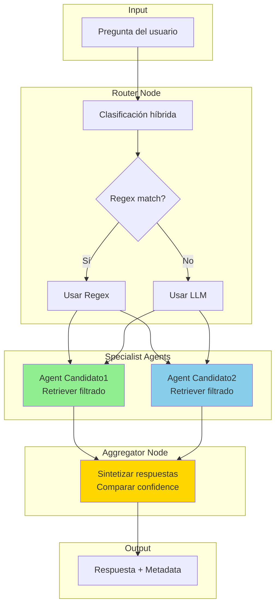
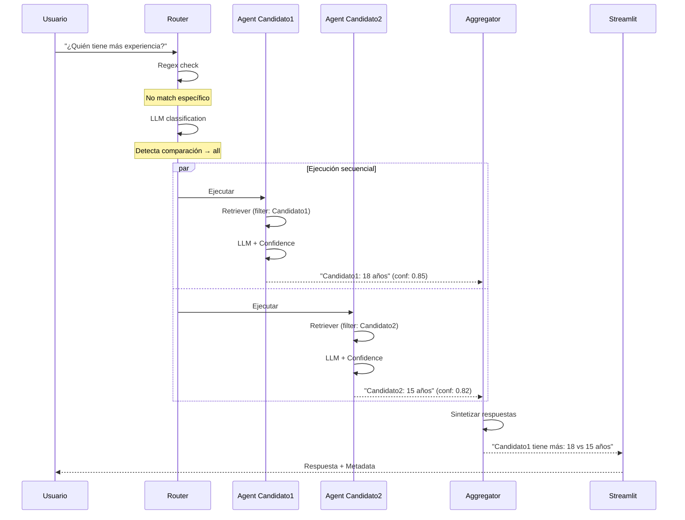

## TP3 - Sistema Multi-Agente RAG con LangGraph

Sistema avanzado de análisis de currículums usando arquitectura multi-agente con LangGraph. Cada candidato tiene un agente especializado que trabaja colaborativamente para responder preguntas.

**Autor:** Martin Brocca  
**Curso:** CEIA - NLP2  
**Universidad:** Universidad de Buenos Aires

## Descripción

Sistema RAG multi-agente que utiliza:
- **Router inteligente**: Decide qué agentes deben responder cada query
- **Agentes especializados**: Uno por candidato, con retrieval filtrado
- **Confidence scores**: Cada agente reporta su nivel de confianza
- **Agregador**: Sintetiza respuestas de múltiples agentes

## Video de demostración
[Video TP3](./Video/Demo_TP3.mov)
[Video TP3 - Parte2](./Video/Demo_TP3_part2.mov)

## Arquitectura



## Estructura del Proyecto

```
TP3/
├── core/                           # Módulos compartidos (de TP2)
│   ├── __init__.py                # Exports del paquete
│   ├── embeddings.py              # CleanEmbeddings wrapper
│   ├── vectorstore.py             # PineconeManager
│   ├── llm.py                     # LLMFactory (Groq + Anthropic)
│   └── utils.py                   # Funciones helper
│
├── state.py                       # AgentState (TypedDict para grafo)
├── graph_nodes.py                 # Implementación de nodos
│   ├── RouterNode                 # Routing híbrido (regex + LLM)
│   ├── SpecialistAgentNode        # Agente por candidato
│   └── AggregatorNode             # Sintetizador de respuestas
│
├── multi_agent.py                 # Clase MultiAgentRAG
├── chatbot_multi.py               # Interfaz Streamlit
├── requirements.txt               # Dependencias (+ langgraph)
├── README.md                      # Este archivo
├── resumes/                       # Carpeta para PDFs
│   ├── Candidato1.pdf
│   └── Candidato2.pdf
└── Video                          # Video de muestra del sistema funcionando
```

## Flujo de Ejecución



## Instalación

### 1. Requisitos previos

- Python 3.11 o superior
- API keys: Pinecone + (Groq o Anthropic)

### 2. Instalar dependencias

```bash
cd Trabajos/TP3
pip install -r requirements.txt
```

**Importante:** TP3 requiere `langgraph>=0.0.40`

### 3. Configurar variables de entorno

Crear `.env` en la raíz:

```bash
PINECONE_API_KEY=tu_api_key
GROQ_API_KEY=tu_api_key          # Opcional
ANTHROPIC_API_KEY=tu_api_key     # Opcional
```

### 4. Preparar carpeta de resumes

```bash
mkdir -p resumes
# Copiar PDFs aquí
```

## Uso

### Ejecutar la aplicación

```bash
cd Trabajos/TP3
streamlit run chatbot_multi.py
```

Abre en `http://localhost:8501`

### Flujo de uso

1. **Indexar CVs**
   - Click "Re-indexar CVs"
   - Esperar a que se creen los agentes
   - Verificar agentes en sidebar

2. **Hacer preguntas**
   - Escribir en chat
   - Ver ejecución en expander "Detalles"

3. **Interpretar resultados**
   - Respuesta final sintetizada
   - Router reasoning (por qué eligió esos agentes)
   - Confidence scores por agente
   - Número de documentos recuperados

## Componentes Técnicos

### 1. Router Node

**Estrategia híbrida:**

```python
# Paso 1: Regex rápido
if "martin" in question.lower():
    return ["martin"]

# Paso 2: Si no match, LLM
prompt = "Clasifica: {question}"
result = llm.invoke(prompt)
```

**Casos manejados:**
- Query específica → Un agente
- Comparación → Todos los agentes
- General → Todos los agentes

### 2. Specialist Agent Node

**Características:**
- Retriever filtrado: `filter_dict={"candidate": "Martin"}`
- Top-5 docs por candidato (vs top-10 global en TP2)
- Prompt especializado: "Eres experto en {candidato}"
- Confidence basado en:
  - Número de docs recuperados
  - Presencia de incertidumbre en respuesta

**Cálculo de confidence:**

```python
def _calculate_confidence(docs, answer):
    # Base: más docs = mayor confianza
    doc_score = min(len(docs) / 5.0, 1.0)
    
    # Penalizar incertidumbre
    if "no tengo información" in answer.lower():
        return min(doc_score * 0.3, 0.4)
    
    return doc_score
```

**Interpretación:**
- 🟢 >= 70%: Alta confianza
- 🟡 40-69%: Confianza media
- 🔴 < 40%: Baja confianza

### 3. Aggregator Node

**Comportamiento:**
- **Un agente:** Pass-through (+ disclaimer si conf < 50%)
- **Múltiples:** Sintetiza considerando confidence

**Prompt del agregador:**

```
Combina las respuestas de los agentes:
- Prioriza agentes con mayor confidence
- Haz comparaciones claras
- Máximo 2-3 párrafos

Agent Candidato1 (85%): ...
Agent Candidato2 (82%): ...
```

### 4. LangGraph State

**Estado compartido entre nodos:**

```python
class AgentState(TypedDict):
    question: str
    chat_history: list
    selected_agents: list[str]
    router_reasoning: str
    agent_responses: dict
    final_response: str
    metadata: dict
```

**Flujo del estado:**
```
Router → selected_agents, router_reasoning
Agents → agent_responses (dict de AgentResponse)
Aggregator → final_response
```

## Ejemplos de Queries

### Query específica

```
Input: "¿Cuántos años de experiencia tiene Candidato1?"

Router: "Regex: Detectó pregunta específica sobre martin"
Agents ejecutados: [Candidato1]
Candidato1: 85% confidence, 4 docs
Respuesta: "Candidato1 tiene más de 18 años de experiencia..."
```

### Query comparativa

```
Input: "¿Quién tiene más experiencia en cloud computing?"

Router: "Regex: Detectó comparación, consultando todos"
Agents ejecutados: [Candidato1, Candidato2]
Candidato1: 72% confidence, 3 docs → "Azure, AWS desde 2015"
Candidato2: 88% confidence, 5 docs → "AWS, GCP desde 2017"
Respuesta: "Candidato1 tiene más experiencia (8 años vs 7 años)..."
```

### Query general

```
Input: "¿Algún candidato vive en Estados Unidos?"

Router: "LLM: Pregunta general, consultando todos"
Agents ejecutados: [Candidato1, Candidato2]
Candidato1: 95% confidence → "Sí, Texas"
Candidato2: 90% confidence → "No, Argentina"
Respuesta: "Candidato1 vive en Estados Unidos (Spring, Texas)..."
```

## Configuración Avanzada

### Ajustar k por agente

En `multi_agent.py`:

```python
retriever = self.vectorstore_manager.get_retriever(
    self.embeddings,
    k=5,  # Modificar aquí (5-10 recomendado)
    filter_dict={"candidate": candidate}
)
```

### Usar modelos diferentes

```python
# Router + Aggregator: Modelo potente
router_llm = LLMFactory.create_llm("claude-sonnet-4-20250514", ...)

# Agents: Modelo rápido
agent_llm = LLMFactory.create_llm("llama-3.1-8b-instant", ...)
```

### Agregar nuevo candidato

1. Agregar PDF en `resumes/`
2. Re-indexar
3. Automáticamente se crea Agent_{nuevo_candidato}

## Metadata Disponible

Cada respuesta incluye:

```python
{
    "response": "...",
    "metadata": {
        "router_decision": ["Candidato1", "Candidato2"],
        "router_reasoning": "Regex: Detectó comparación...",
        "router_method": "regex",  # o "llm"
        "agents_executed": 2,
        "agent_details": {
            "Candidato1": {
                "confidence": 0.85,
                "retrieved_docs": 4
            },
            "Candidato2": {
                "confidence": 0.82,
                "retrieved_docs": 5
            }
        }
    }
}
```

## Troubleshooting

### Error: "module 'langgraph' has no attribute 'graph'"

```bash
pip install --upgrade langgraph
```

### Confidence siempre baja

- Verificar que los PDFs tengan contenido relevante
- Aumentar k en retrievers
- Revisar filtros de metadata

### Router siempre usa LLM

- Los nombres de candidatos no están en la query
- Ajustar regex patterns en `RouterNode._regex_route()`

### Agentes no se ejecutan en paralelo

- Esto es intencional (ejecución secuencial)
- Para paralelización: modificar `_run_agents_node()` con asyncio

## Extensiones Futuras

### 1. Paralelización con asyncio

```python
async def _run_agents_node_async(state):
    tasks = [agent(state) for agent in selected_agents]
    responses = await asyncio.gather(*tasks)
    return responses
```

### 2. Cache de respuestas

```python
cache = {}
cache_key = f"{question}_{agent_name}"
if cache_key in cache:
    return cache[cache_key]
```

### 3. Agente de fallback

Si todos los agentes tienen confidence < 50%:
```python
if max(confidences) < 0.5:
    return "No tengo suficiente información para responder con confianza"
```

### 4. Métricas de timing

```python
import time

start = time.time()
# ... ejecutar nodo ...
metadata["timing"] = {
    "router": 0.2,
    "agents": 1.3,
    "aggregator": 0.5
}
```


## Contacto

Martin Brocca - CEIA, Universidad de Buenos Aires  
martinbrocca@gmail.com
